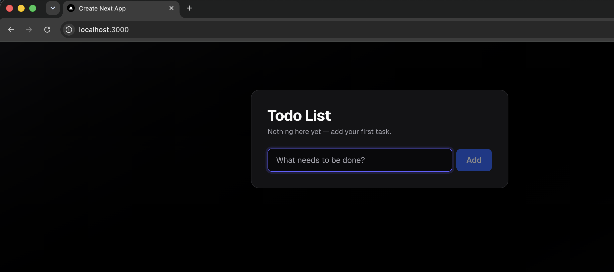

# Cook PoC

Tool Repo: https://github.com/rjcorwin/cook

Run the app locally:

```sh 
npm run dev
```

Open in the browser the application: http://localhost:3000/




The current app doesn't persist any information. Let's use cook agent to implement persistence using LocalStorage.

```shell
cook "Implement localStorage persistence for the todo app. Restore tasks and completion state after refresh. Keep initialization hydration-safe, prevent the initial empty state from overwriting saved tasks, avoid an empty-state flash, handle malformed saved data and unavailable storage, and synchronize updates from other tabs. Do not suppress ESLint rules or add dependencies. Add Vitest/React Testing Library tests for these behaviors." \
  "Review the implementation and tests for hydration issues, persistence edge cases, cross-tab updates, and whether the tests exercise the requirements. Do not edit code." \
  "Return DONE only if the persistence requirements are satisfied; otherwise return ITERATE and list what remains."
```
